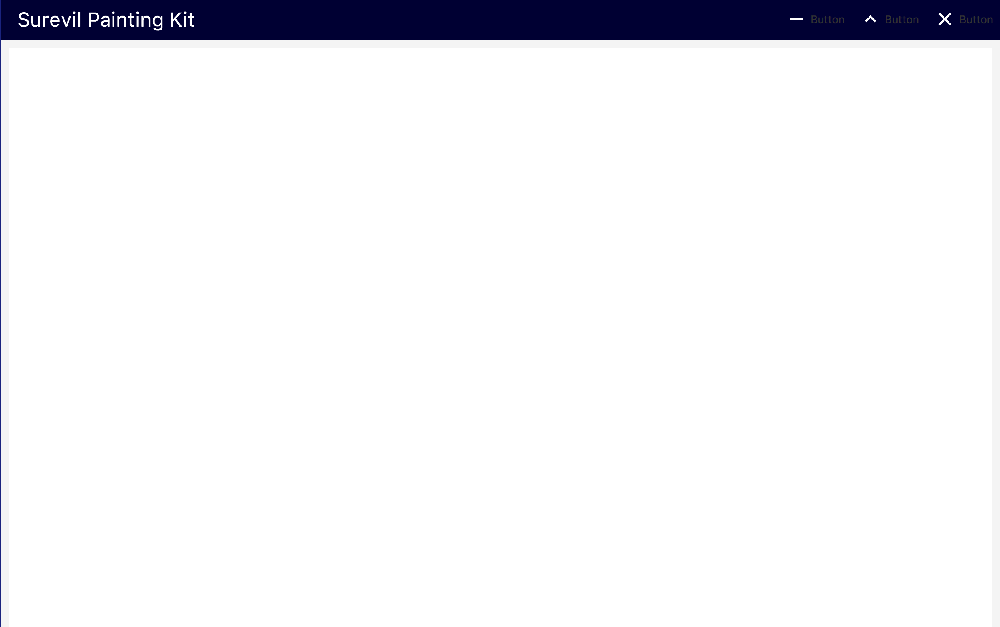
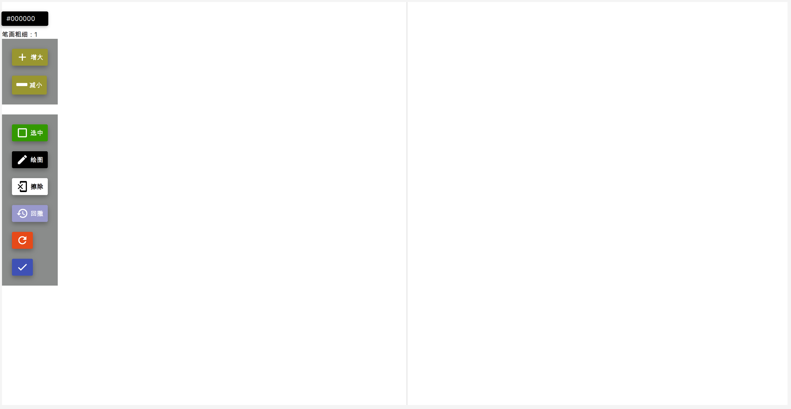
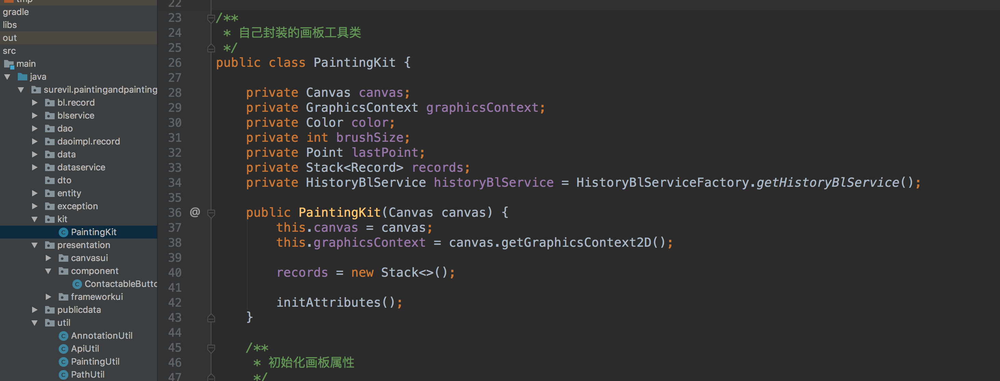
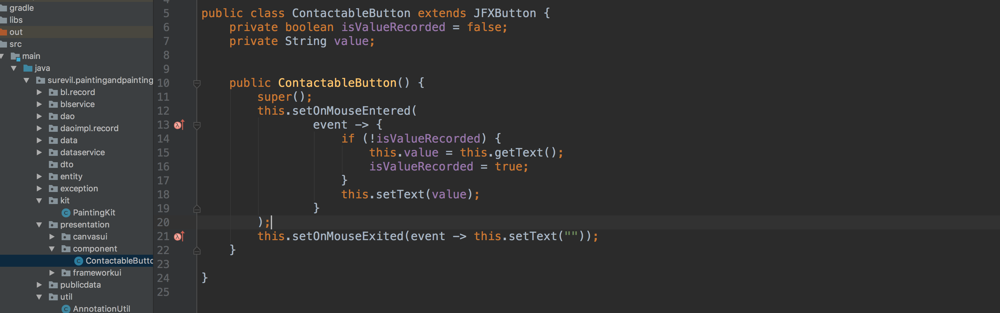
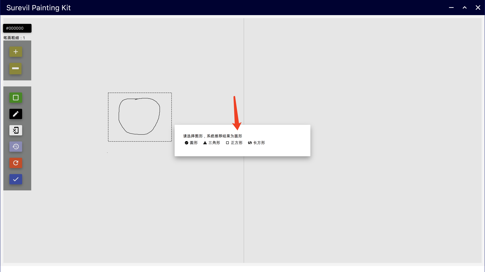

# Surevil Painting Kit
---
## 一、运行方式

### 前提：运行计算机需要有java8环境
- 1、直接运行根目录下的"SurevilPaintingKit.jar"文件即可（推荐）
- 2、使用IDEA导入整个项目，运行MainApplication

## 二、项目简介

整体项目使用java8编写,以javafx书写界面，并使用gradle进行依赖管理

## 三、整体架构

### 总：

采取分层的设计，底层使用自行编写的一套基于JAVA注解的文件存储持久化框架,封装了dao层（模仿JPA），然后使用data层调用dao层的类进行对象存储，以及bl层调用data层并处理相应的业务逻辑，最后的presentation层即javafx中的controller类所在的目录，调用bl层并进行与界面的交互。

- 为了降低整体项目的耦合性，整体项目将框架的UI与画板的UI抽离开来，如下图：
  
  
上图分别为框架UI与画板UI，运行时先加载框架UI
```java
FXMLLoader frameworkLoader = new FXMLLoader();
frameworkLoader.setLocation(getClass().getResource("/fxml/frameworkui/FrameworkUi.fxml"));
Scene scene = new Scene(frameworkLoader.load());

FrameworkUiController controller = frameworkLoader.getController();

primaryStage.initStyle(StageStyle.UNDECORATED);

primaryStage.setScene(scene);

primaryStage.setHeight(900);
primaryStage.setWidth(1600);
```
然后画板UI被插入其中
```java
FXMLLoader contentLoader = new FXMLLoader();
contentLoader.setLocation(getClass().getResource("/fxml/canvasui/CanvasUi.fxml"));
Node contentNode = contentLoader.load();
controller.setContent(contentNode);
```
以此可以达到抽离画板UI的目的并方便框架UI的复用，即现在整个项目即便仅运行第二段画板UI也是可以达到所有功能的
<br/>

- 为了方便复用及降低耦合性，基于Canvas及GraphicsContext，隔绝上层封装了一个PaintingKit,实现了画线（外部表现为画点），擦除，画框，单步回撤（具体回撤策略由上层决定，在此类中只提供回撤接口），清屏，保存，加载打标签，画图形等接口，满足了整体的画板需要，同样，抽取此类出来即可满足新的画板功能需要
  
<br/>

- 同样为了方便复用，整体项目抽取了一个ContactableButton组件类，因为基于实际情况考虑，一个擦边栏按钮可能在用户初次了解之后就能仅通过较明显的图标来分辨出其作用，所以当用户鼠标第一次移到该按钮上，按钮文字便会隐藏，直到用户下一次移动到该按钮上
  
<br/>

## 四、简单的使用说明

- 快捷键
  Q:选择框 
  W:画笔 
  E:擦除 
  Z:回撤
  X:清空
  S:保存
  [:减小画笔粗细
  ]:增大画笔粗细
<br/>

- 关于识别
  
  识别采用提示的方式，主动权仍在用户手中
<br/>

- 其他功能可根据页面提示自行使用